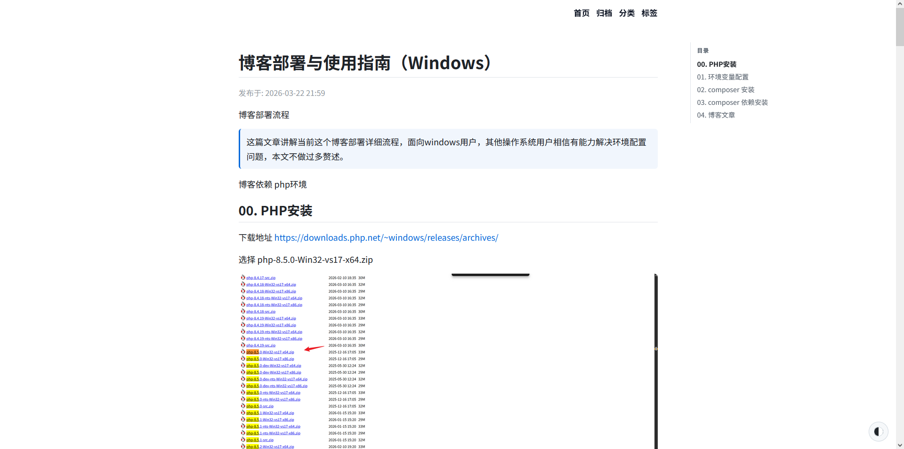
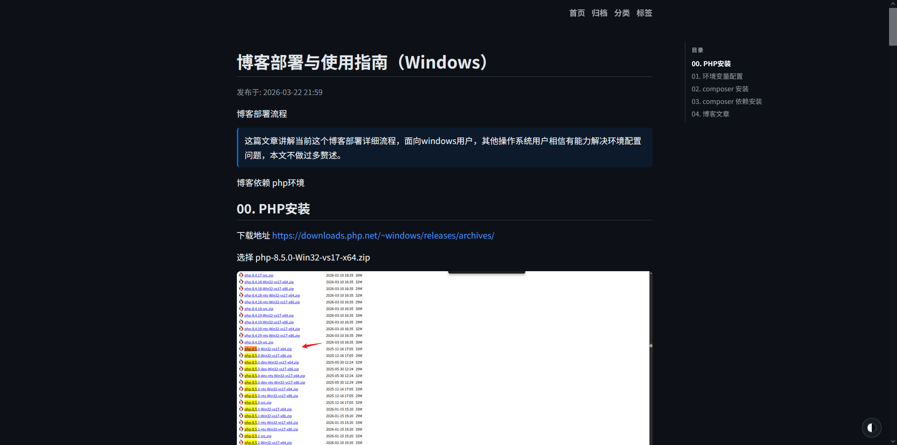

# the0n3 blog

<div align="center">
<h5>一个基于 Markdown 的极简博客系统，专注 Markdown 写作，自动生成静态站点并支持一键部署。</h5>








</div>


## ✨ 特性

**🎨 界面与体验**
* **自适应主题**：支持浅色/深色主题无缝切换。
* **沉浸式阅读**：向上滚动自动显示导航栏，阅读进度条与目录联动高亮。
* **自动化目录**：文章页基于 `h2`/`h3` 标签自动生成侧边栏目录。
* **多媒体增强**：构建期自动补全图片加载提示，并内置图片点击放大功能。

**📝 写作与内容**
* **纯粹的 Markdown**：使用带有 YAML Front Matter 的 Markdown 文件作为文章数据源。
* **全自动化生成**：自动生成首页、标签页、分类页、归档页及文章详情页。
* **扩展语法支持**：内置 Callout 提示块语法（如 `[!NOTE]`, `[!TIP]` 等）。

**🚀 构建与部署**
* **CI/CD 集成**：支持通过 GitHub Actions 自动构建并部署至 `gh-pages` 分支。
* **SEO 友好**：基于 `config/site.php` 自动生成 `sitemap.xml`。
* **构建日志**：构建过程会自动输出详细日志至 `logs/build.log`。

**🧩 扩展支持**
* **代码高亮**：集成 Prism 代码高亮引擎。
* **评论系统**：原生支持 Giscus 评论系统接入。

## 🚀 快速开始

### 1. 环境准备

确保您的本地环境已安装以下组件：
* PHP ≥ 7.4
* Composer
* Git

安装 PHP、Composer、git：


windows

```bash
# windows powershell，管理员权限运行
# 过程中会提示是否修改执行策略，输入 Y 确认。
Set-ExecutionPolicy RemoteSigned -Scope CurrentUser
irm get.scoop.sh | iex
scoop install php composer git
```

MacOS

```bash
# macOS
brew install php composer git
```

Ubuntu/Debian

```bash
# Ubuntu/Debian  
sudo apt-get install php composer git
```


### 2. 获取项目与安装依赖

```bash
git clone https://hk.gh-proxy.org/https://github.com/Apursuit/the0n3-blog-template.git
cd the0n3-blog-template
```

composer 依赖安装：

```bash
composer install
```

### 3. 开始写作

运行以下命令快速生成新文章模板：

```bash
php main.php new "文章标题"
```

这会打印出一个包含 Front Matter 的 Markdown 模板，你可以手动在 posts/ 下创建一个新的 Markdown 文件，把生成的模板内容复制进去

**注意，--- 分隔符必须顶格、并且必须出现在文件开头**

### 4. 构建博客

书写完成后，执行构建命令生成静态文件：

```bash
php main.php build
```

构建流程： 清空 dist/ ➔ 资源映射 ➔ 解析 Markdown ➔ 校验数据 ➔ 构建数据索引 ➔ 渲染页面。

完成后，使用 PHP 内置服务器进行本地服务预览：

```bash
php -S localhost:8000 -t dist/
```

访问 http://localhost:8000 即可看到博客首页，至此，你已经成功搭建了自己的博客！后续在 posts/ 目录下添加 Markdown 文章，重复构建流程即可更新博客内容。


如果要让其他人可以看到你的博客，可以部署在 github pages，把 dist/ 目录下的所有文件推送到 gh-pages 分支即可。


## 🌐 部署指南 (GitHub Pages)

本模板已配置好完整的自动化部署流程。当您将本地更新推送到 GitHub 仓库时，GitHub Action 会自动触发构建流程，并将生成的静态文件推送到 gh-pages 分支，实现自动部署。

你的Github 仓库名需要设置为 username.github.io（其中 username 替换为你的 GitHub 用户名），这样 GitHub Pages 才能正确识别并部署你的博客。

权限配置步骤：

在 GitHub 仓库页面，进入 Settings ➔ Actions ➔ General。

向下滚动至 Workflow permissions 部分。

选择 Read and write permissions 并保存。


## ⚙️ 进阶配置

所有站点核心配置均位于 config/site.php。您可以在其中配置站点的 Title、Author、URL（用于生成 sitemap.xml 的站点根地址）等基础信息。

## Giscus 评论系统

默认关闭。如需启用，请在 config/site.php 的 giscus 配置中填入你自己的参数（repo / repo_id / category / category_id）。

重要：不要直接使用他人的配置，否则评论会写入对方仓库。

注意：启用 Giscus 评论系统需要在 GitHub 仓库创建 Discussions，具体步骤参考这篇文章 https://www.lixueduan.com/posts/blog/02-add-giscus-comment/

## 目录结构

```plaintext
.
├── assets/      # 前端资源（CSS / JS / Prism 代码高亮）
├── config/      # 站点配置目录
├── logs/        # 构建日志目录（默认追加写入，超过14天自动清空重写）
├── posts/       # Markdown 文章源文件（支持子目录嵌套）
├── public/      # 静态资源（构建时会原样拷贝至 dist/ 根目录）
├── images/      # 图片资源（构建时会原样拷贝至 dist/images/）
├── src/         # 核心 PHP 业务逻辑代码
├── templates/   # HTML 页面模板
├── dist/        # 构建后的最终静态站点输出目录（执行 build 后生成）
└── main.php     # CLI 工具统一入口文件
```


## 文章格式

每篇文章为 Markdown 文件，需包含 YAML Front Matter，例如：

```yaml
---
title: Hello World
date: 2026-03-20
permalink: /posts/hello-world/
tags:
    - 示例
categories:
    - 示例
pin: 0
draft: false
sidebar: true
---
```
文章文件放在 posts/ 下即可（可分子目录）。

### Front Matter 字段说明

必需字段（缺失会报错）：

- title：文章标题
- date：日期（支持 YYYY-MM-DD 或可被解析的字符串）
- permalink：文章永久链接（例如 /posts/hello-world/）

可选字段（未填写会自动补默认值）：

- tags：标签数组，默认 []
- categories：分类数组，默认 []（支持单个字符串）
- pin：置顶优先级，0-3，数字越小优先级越高，默认 0
- draft：是否草稿，默认 false（true 时构建会跳过）
- sidebar：是否显示文章目录侧边栏，默认 true

## 图片加载策略

构建时会对 Markdown 与页面 HTML 中的图片做统一后处理：

- 所有图片都会补充 `decoding="async"`，减少图片解码对页面渲染的阻塞。
- 每篇文章或独立页面中的第一张图片不会自动补充 `loading="lazy"`，避免首屏图片或 LCP 图片被延后加载。
- 从第二张图片开始，如果没有手动声明 `loading`，会自动补充 `loading="lazy"`，降低长文章中大量截图的首屏加载压力。
- 如果图片已经手动写了 `loading` 或 `decoding`，构建器会保留原值，不会覆盖。
- 图片点击放大由 `assets/features/image-enhance/` 提供；给图片添加 `data-no-lightbox="true"` 可以跳过灯箱，例如友链头像。

示例：

```html


```

## 备注

- 主题与排版变量在 assets/css/site.css 中
- 目录由前端脚本根据 h2/h3 生成
- 阅读进度条：assets/js/readingProgress.js + assets/css/reading-progress.css
- 图片增强：assets/features/image-enhance/script.js + assets/features/image-enhance/style.css
- 导航栏自动显示：assets/js/navReveal.js + assets/css/nav-reveal.css
- Callout 与图片加载属性由 Markdown 后处理完成（src/Markdown.php）
- 构建日志写入 logs/build.log（默认追加写入；超过 14 天会自动清空重写；每次构建会写入分隔线）
- main.php 固定时区为 Asia/Shanghai，保证日志与日期输出为北京时间
- permalink 会做冲突校验：不能与系统页（/tags/、/categories/、/archives/）或 public/images 下已有文件路径冲突

## 性能测试

在一台 Windows 设备上，构建一个包含 182 篇文章、约 200MB 图片资源的博客，完整构建时间约为 2 秒。

主要耗时集中在静态资源复制（`assets/`、`public/`、`images/` → `dist/`），Markdown 解析与页面渲染开销较低。

```bash
$ php main.php build
[2026-04-09 13:53:11] [信息] 开始构建...
[2026-04-09 13:53:11] [信息] 清理 dist 目录...
[2026-04-09 13:53:11] [信息] 1. 清空 dist/ 用时 0.376 秒。
[2026-04-09 13:53:11] [信息] 复制静态资源...
[2026-04-09 13:53:12] [信息] 2. 资源映射 用时 1.021 秒。
[2026-04-09 13:53:12] [信息] 加载并处理文章...
[2026-04-09 13:53:12] [信息] 跳过草稿：2 篇。
[2026-04-09 13:53:12] [信息] 3. 解析 Markdown 用时 0.042 秒。
[2026-04-09 13:53:12] [信息] 校验文章数据...
[2026-04-09 13:53:12] [信息] 4. 校验数据 用时 0.004 秒。
[2026-04-09 13:53:12] [信息] 准备数据...
[2026-04-09 13:53:12] [信息] 5. 构建数据索引 用时 0.161 秒。
[2026-04-09 13:53:12] [信息] 生成页面...
[2026-04-09 13:53:13] [信息] 6. 渲染页面 用时 0.153 秒。
[2026-04-09 13:53:13] [信息] 生成搜索索引...
[2026-04-09 13:53:13] [信息] 搜索索引已生成：919.57KB
[2026-04-09 13:53:13] [信息] 7. 生成搜索索引 用时 0.013 秒。
[2026-04-09 13:53:13] [信息] 构建完成，用时 1.77 秒。
[2026-04-09 13:53:13] [信息]  - 生成文章数：186
[2026-04-09 13:53:13] [信息]  - 标签数：144
[2026-04-09 13:53:13] [信息]  - 分类数：23
```


## 计划中的功能

- Logo、favicon、社交链接、关于页等站点细节
- 增量构建


## 📝 贡献

欢迎提交 Issue 和 Pull Request！

## 📄 许可证

MIT
